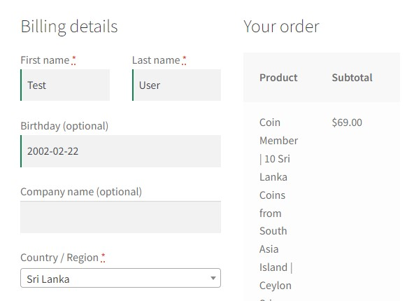
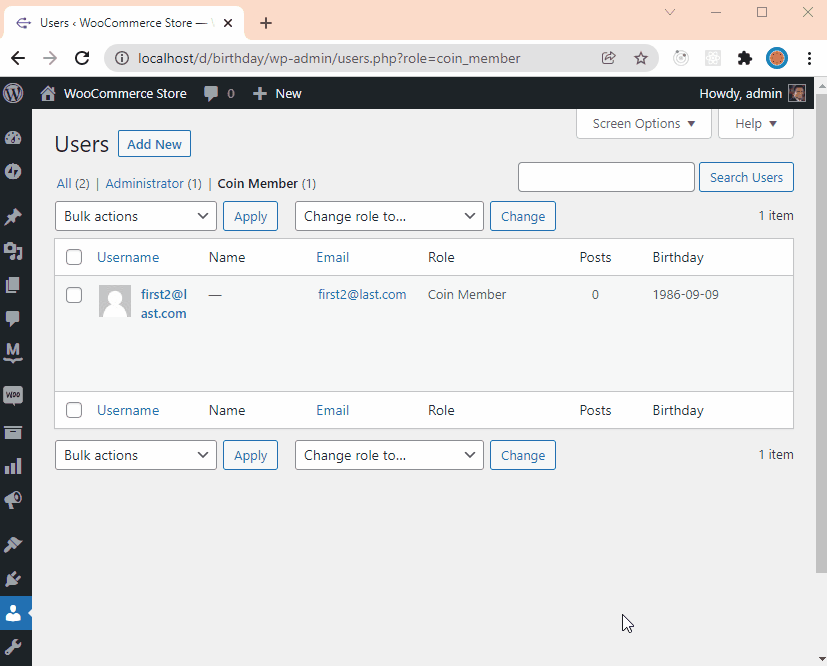
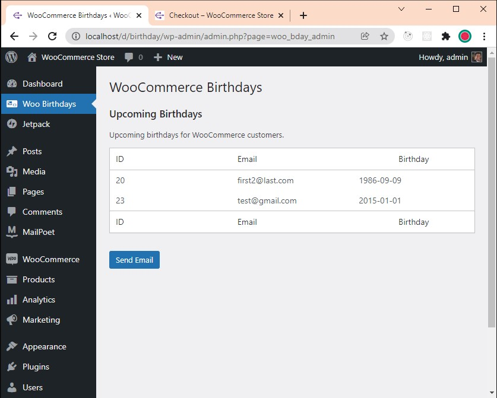

# WooCommerce Birthdays

The plugin lets you collect birthdays from the customers at the checkout page. 

# User Table with Birthdays

Next, it adds the customer as a user to WordPress as a 'coin-member'. (Removes the default role subscriber.) Then it adds a column to a user table to display the collected birthday.

# Birthday Reminder Page

This table list the birthdays of 'coin-members'. This can be customized to filter specific month only. Also, <b>WordPress Cron</b> can be used to send emails automatically.

